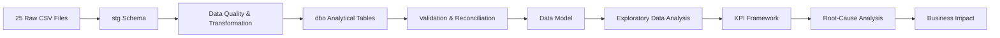

# Southern Cross Industrial Supply (SCIS) — Supply Chain Intelligence System

### SQL Server · Supply Chain Analytics · KPI Development · Root-Cause Analysis

SCIS is an end-to-end supply chain analytics project built in **Microsoft SQL Server and SSMS**.

The project uses **25 CSV files containing 196,460 rows** across customer orders, procurement, suppliers, inventory, production, warehousing, logistics, quality, returns, contracts, foreign exchange and bill-of-materials data.

The goal was to take a large group of connected operational tables and answer a simple question:

> **Where is the supply chain performing poorly, why is it happening, and how important is the problem?**

The workflow covers the full analysis process:

**Raw Data → Staging → Cleaning & Validation → Final Tables → EDA → KPIs → Root Causes → Business Impact**

---

## Project Snapshot

| Item | Scope |
|---|---:|
| Source Files | **25 CSVs** |
| Source Rows | **196,460** |
| Products | **150** |
| Suppliers | **60** |
| Facilities | **5** |
| Customer Orders | **9,000** |
| Customer Order Lines | **27,073** |
| Purchase Orders | **6,500** |
| Purchase Order Lines | **22,737** |
| Shipments | **5,907** |
| Inventory Snapshots | **42,900** |
| Production Orders | **1,800** |
| Quality Inspections | **10,000** |
| Main Analysis Period | **Jan 2025 – Jun 2026** |
| Platform | **Microsoft SQL Server / SSMS** |

---

# Business Problem

Supply chain problems rarely come from one table or one department.

For example, a late customer delivery might be caused by:

- a supplier delivering late
- low inventory
- poor demand forecasting
- production downtime
- quality problems
- warehouse delays
- transport delays

or several of these happening together.

This project therefore looks at the supply chain as **one connected system**.

The main questions were:

- Are customer orders being fulfilled fully and on time?
- Where are inventory shortages happening?
- Are suppliers and purchase orders performing reliably?
- Are production and quality problems affecting supply?
- Are warehouses and carriers creating delays?
- Where is working capital tied up?
- Which operational problems are large enough to matter?

---

# Data Architecture



## SQL Layers

| Layer | Purpose |
|---|---|
| **Raw CSV Files** | Original source data |
| **`stg` Schema** | Initial landing area with minimal changes |
| **Transformation & QA** | Cleaning, validation and relationship checks |
| **`dbo` Tables** | Final analytical tables |
| **Analytical SQL** | EDA, KPI calculation, root-cause and impact analysis |

I kept the staging and final tables separate so that transformed data could always be checked against the original source.

---

# Dataset Coverage

| Domain | Main Data | Rows |
|---|---|---:|
| Master & Reference | Products, suppliers, warehouses, carriers, contracts, BOM, FX | **1,132** |
| Demand & Customer Orders | Orders, order lines, forecasts | **41,473** |
| Procurement & Receiving | Purchase orders, PO lines, receipts | **46,981** |
| Inventory | Inventory snapshots and stock movements | **60,900** |
| Production | Production orders, events and downtime | **9,109** |
| Quality & Returns | Inspections and returns | **11,039** |
| Logistics | Shipments and shipment lines | **23,642** |
| Warehouse Operations | Warehouse activity | **2,184** |
| **Total** | **25 files** | **196,460** |

<details>
<summary><strong>View all source files</strong></summary>

- `bom.csv`
- `carriers.csv`
- `contracts.csv`
- `customer_order_lines.csv`
- `customer_orders.csv`
- `demand_forecast.csv`
- `downtime_events.csv`
- `fx_rates.csv`
- `goods_receipts.csv`
- `inventory_snapshots.csv`
- `production_events.csv`
- `production_orders.csv`
- `products.csv`
- `purchase_order_lines.csv`
- `purchase_orders.csv`
- `quality_inspections.csv`
- `regions.csv`
- `returns.csv`
- `shipment_lines.csv`
- `shipments.csv`
- `stock_movements.csv`
- `supplier_products.csv`
- `suppliers.csv`
- `warehouse_operations.csv`
- `warehouses.csv`

</details>

---

# SQL Workflow

The project is divided into separate stages so that each part of the analysis can be checked before moving forward.

| Chapter | Stage | What Happens |
|---|---|---|
| **3** | Extract | Load CSV files into SQL Server using `BULK INSERT` |
| **4** | Transform | Check nulls, duplicates, dates, text, numbers, currencies and relationships |
| **5** | Load | Populate the final analytical tables |
| **6** | Validate | Check keys, joins, quantities, row counts and denominators |
| **7** | Model | Document table grain and relationships |
| **8** | EDA | Explore the main supply chain processes |
| **9** | Analysis | Analyse inventory, suppliers, logistics, production and fulfilment |
| **10** | KPIs | Build repeatable business measures |
| **11** | Root Causes | Investigate why poor performance is occurring |
| **12** | Business Impact | Estimate financial and operational exposure |

---

# Data Quality & Validation

A large part of this project was making sure the SQL calculations were based on reliable joins and valid data.

Checks included:

- staging-to-final row counts
- duplicate detection
- null checks
- primary and business-key checks
- text cleaning
- unusual numeric values
- suspicious date sequences
- orphan records
- master-to-detail relationships
- purchase-order header and line grain
- shipment header and line grain
- join multiplication
- currency checks
- FX coverage
- forecast versions
- inventory movement signs
- KPI denominators

---

## Examples of Data Issues Found

The raw data contained several issues that were flagged for investigation rather than silently changed.

Examples include:

- **8** PO lines with negative ordered quantity
- **8** PO lines with missing unit price
- **12** PO lines with missing expected delivery date
- **6** goods receipt rows with missing received quantity
- **6** customer orders with missing requested delivery date
- inconsistent spacing and casing in several text fields

Keeping these problems visible preserves the audit trail and avoids pretending that questionable data is normal.

---

# Why Data Grain Matters

One of the most important parts of the project was checking the **grain** of each table before joining data.

For example:

- `shipments` contains one row per shipment
- `shipment_lines` contains several rows per shipment

If shipment-level freight is joined to shipment lines and then summed, the same freight cost gets repeated several times.

The project specifically checks for this type of **join multiplication**.

The same issue can occur with:

- customer orders vs order lines
- purchase orders vs PO lines
- production orders vs production events
- shipments vs shipment lines
- forecasts with multiple versions

This is why table grain is documented before KPI calculations are performed.

---

# KPI Framework

## Inventory

- Average inventory
- Inventory value
- Inventory turnover
- Days in inventory
- Stockout rate
- Reorder-point breach rate
- Safety-stock breach rate
- Slow-moving inventory
- Fast-moving inventory
- Dead-stock exposure
- ABC classification

---

## Demand & Forecasting

- Monthly demand
- Demand variability
- Seasonality
- Forecast vs actual demand
- Absolute forecast error
- Forecast error by version

---

## Procurement

- Procurement spend
- Contract compliance
- Non-compliant spend
- Purchase-price spread
- Purchase-price variance
- Supplier concentration

---

## Suppliers

- Lead time
- Lead-time variability
- On-time receipt rate
- OTIF
- Rejection rate
- Supplier concentration
- Single-source exposure

---

## Customer Fulfilment

- Fill rate
- Backorder rate
- On-time delivery
- Late-delivery rate
- Average days late
- Perfect-order rate
- Order-cycle time

---

## Warehouse

- Throughput
- Lines picked per labour hour
- Pick-error rate
- Capacity utilisation

---

## Production

- Production throughput
- Yield
- Scrap rate
- Schedule adherence
- Cycle time
- Downtime
- Scrap-value exposure

---

## Quality

- Defect rate
- Inspection failure rate
- Product-level defect rate
- Defect source
- Defect type

---

## Logistics & Returns

- Freight cost
- Average freight per shipment
- Freight by carrier
- Carrier on-time performance
- Transport lead time
- Late-shipment rate
- Return quantity
- Return rate
- Return-value exposure

---

# Selected Results

The following results were calculated from the supplied dataset using the KPI definitions in the SQL project.

| Area | Result | What It Shows |
|---|---:|---|
| **Fill Rate** | **64.13%** | A large amount of ordered quantity was not represented as shipped quantity |
| **Backorder Rate** | **35.87%** | Equivalent to **879,544 units** under the project definition |
| **On-Time Delivery** | **34.11%** | Delivery reliability is a major issue |
| **Late-Delivery Rate** | **65.89%** | Late shipments averaged **4.51 days late** |
| **Perfect-Order Rate** | **28.92%** | Fully shipped orders without a return event |
| **Contract-Compliant PO Lines** | **75.06%** | Around one-quarter fall outside the compliance flag |
| **Stockout Snapshots** | **8.09%** | Repeated zero or negative stock positions appear in the data |
| **At / Below Reorder Point** | **55.03%** | Replenishment thresholds are frequently reached |
| **Below Safety Stock** | **26.34%** | Indicates recurring inventory pressure |
| **Single-Source Products** | **33** | All 33 recorded at least one stockout snapshot |
| **Average Inventory Value** | **A$6.90M** | Working-capital proxy |
| **Production Yield** | **96.27%** | Production output is generally high-yield |
| **Scrap Rate** | **3.73%** | Around **A$5.41M** of standard-cost scrap exposure |
| **Recorded Downtime** | **2,965.1 hours** | Useful for capacity and cause analysis |
| **Quantity Defect Rate** | **4.15%** | Defective units as a share of inspected units |
| **Inspection Failure Rate** | **30.04%** | Failed inspection events occur much more often than defective units |
| **Total Freight Cost** | **A$3.63M** | Calculated at shipment grain |
| **Return Rate** | **0.66%** | Returned quantity as a share of shipped quantity |
| **Return Value Exposure** | **A$2.16M** | Standard-cost proxy |

> Some financial measures are **exposure estimates**, not booked accounting losses. Procurement currencies are also kept separate unless an FX conversion is explicitly applied.

---

# Key Findings

## 1. Customer Fulfilment Is the Biggest Overall Problem

The project produced a **64.13% fill rate** and a **65.89% late-delivery rate**.

That suggests customer-service problems are not limited to one part of the supply chain.

The root cause could sit in:

- inventory
- suppliers
- production
- warehousing
- logistics

or a combination of them.

This is why the analysis follows poor customer fulfilment back through the rest of the supply chain instead of assuming that late delivery is only a transport problem.

---

## 2. Single-Source Products Need Attention

The dataset contains **33 single-source products**.

Every one of those products recorded at least one stockout snapshot.

This does not prove that single sourcing caused the stockout, but it identifies a clear group for further review.

Possible questions include:

- Is there an alternative supplier?
- Is safety stock high enough?
- Is supplier lead time reliable?
- Is demand more volatile than expected?

---

## 3. Replenishment Levels Are Frequently Under Pressure

Around **55.03%** of inventory snapshots were at or below reorder point.

Around **26.34%** were below safety stock.

That does not automatically mean every one of those observations represents a failure, but the frequency is high enough to justify product- and warehouse-level investigation.

---

## 4. Production Yield Is High, but Scrap Still Matters

Overall production yield is **96.27%**.

At first glance that looks strong.

However, the remaining scrap represents approximately **A$5.41M in standard-cost exposure**, and the dataset also records **2,965.1 hours of downtime**.

This is why production performance needs to be looked at from more than one angle.

---

## 5. Quality Needs Two Different Measures

The project separates:

- **Inspection Failure Rate: 30.04%**
- **Quantity Defect Rate: 4.15%**

These are not the same thing.

A failed inspection event might involve only a small number of defective units.

Keeping the two measures separate prevents the quality problem from being overstated or misunderstood.

---

## 6. Procurement Compliance Can Be Measured Directly

Around **75.06% of purchase-order lines** are marked as contract compliant.

That leaves roughly one-quarter outside the compliance flag.

Because procurement records use several currencies, monetary values are kept separate by currency unless FX conversion is applied.

---

# Root-Cause Analysis

The project does not stop after finding a bad KPI.

The next question is:

> **Why is it happening?**

Root-cause analysis is performed across:

- stockouts
- excess inventory
- forecasting
- supplier performance
- procurement
- purchase-order execution
- customer fulfilment
- warehouse operations
- production
- quality
- logistics
- returns

The analysis also compares stronger and weaker-performing groups to identify useful differences.

### Example

```text
Late Customer Delivery
        ↓
Late Shipment or Incomplete Shipment
        ↓
Inventory Shortage / Production Delay / Warehouse Delay
        ↓
Supplier / Forecast / Material / Quality / Capacity Issue
        ↓
Customer + Operational + Financial Impact
```

The purpose is not to automatically label correlation as causation.

It is to narrow the investigation from a broad KPI problem to a smaller set of plausible operational drivers.

---

# Business Impact

The final stage translates operational issues into measures that are easier to prioritise.

## Financial

- Procurement spend
- Purchase-price variance
- Non-compliant procurement
- Scrap exposure
- Return exposure
- Freight cost

## Working Capital

- Average inventory value
- Slow-moving inventory
- Dead stock
- Over-forecast inventory

## Customer Impact

- Backorder quantity
- Backorder value proxy
- Late orders
- Orders affected by returns

## Service

- Late-delivery rate
- Average days late
- Fill rate
- SLA breaches
- Perfect orders

## Productivity & Capacity

- Warehouse productivity
- Pick errors
- Downtime
- Scrap
- Production output loss
- Material shortage

## Risk

- Single-source products
- Single-source products with stockouts
- Supplier delivery problems
- Forecast risk
- Quality risk
- Customer-service risk

---

# SQL Techniques Used

The project mainly uses standard analyst-level SQL applied across a large relational dataset.

```sql
SELECT
WHERE
ORDER BY
DISTINCT

GROUP BY
HAVING

SUM()
AVG()
COUNT()
MIN()
MAX()

CASE

DATEDIFF()
YEAR()
MONTH()

INNER JOIN
LEFT JOIN

UNION ALL

Subqueries
NOT EXISTS

CTEs

Window Functions
PARTITION BY
ORDER BY ... OVER()

NULLIF()

BULK INSERT

INFORMATION_SCHEMA
```

The important part was not using complicated SQL for its own sake.

The SQL was used to solve practical problems such as:

- joining operational tables safely
- calculating KPIs
- ranking exceptions
- finding outliers
- checking reconciliations
- identifying missing relationships
- comparing business groups
- tracing operational problems
- estimating financial exposure

---

# Analytical Rules Used

A few rules were followed throughout the project:

1. **Do not combine currencies without converting them.**
2. **Do not mix forecast versions without defining which version is being analysed.**
3. **Do not assume every NULL is an error.**
4. **Do not turn valid negative inventory movements into positive values.**
5. **Do not sum shipment-level freight after joining it to shipment lines.**
6. **Define the denominator before calculating a percentage KPI.**
7. **Check table grain before joining.**
8. **Call financial proxies proxies, not realised losses.**
9. **Keep the original source data available for reconciliation.**

These checks are important because a technically valid SQL query can still produce the wrong business answer if the underlying grain or definition is wrong.

---

# Repository Structure

```text
SCIS-Supply-Chain-Intelligence-System-Portfolio-7/
│
├── README.md
├── SCIS_Supply_Chain_Analysis.sql
│
└── data/
    ├── bom.csv
    ├── carriers.csv
    ├── contracts.csv
    ├── customer_order_lines.csv
    ├── customer_orders.csv
    ├── demand_forecast.csv
    ├── downtime_events.csv
    ├── fx_rates.csv
    ├── goods_receipts.csv
    ├── inventory_snapshots.csv
    ├── production_events.csv
    ├── production_orders.csv
    ├── products.csv
    ├── purchase_order_lines.csv
    ├── purchase_orders.csv
    ├── quality_inspections.csv
    ├── regions.csv
    ├── returns.csv
    ├── shipment_lines.csv
    ├── shipments.csv
    ├── stock_movements.csv
    ├── supplier_products.csv
    ├── suppliers.csv
    ├── warehouse_operations.csv
    └── warehouses.csv
```

---

# Running the Project

## Requirements

- Microsoft SQL Server
- SQL Server Management Studio
- Local access to the CSV files

## Steps

1. Create or select the `SCIS` database.
2. Create the required staging and final tables.
3. Place the CSV files in a location that SQL Server can access.
4. Update the `BULK INSERT` file paths.

Example:

```sql
FROM 'C:\SCIS_DATA\products.csv'
```

5. Run the SQL project from **Chapter 3 through Chapter 12**.
6. Review the validation results before relying on the KPI outputs.

---

## Current Setup Note

The main SQL script starts at **Chapter 3 — Extract**.

It assumes that the staging and final table structures have already been created.

A future improvement would be to add a separate:

```text
01_schema_setup.sql
```

containing:

- `CREATE DATABASE`
- `CREATE SCHEMA`
- `CREATE TABLE`

statements.

---

# Assumptions & Limitations

- KPI definitions follow the business rules documented in the SQL script.
- Another organisation may define some KPIs differently.
- Procurement data contains several currencies.
- Monetary values are not combined unless FX conversion is applied.
- Forecast versions remain separate.
- Negative stock movements can represent valid outbound activity.
- Scrap and return values use standard cost and should be treated as exposure estimates.
- Some source-data problems are intentionally flagged rather than automatically corrected.
- The current repository focuses on SQL analysis rather than a Power BI dashboard.

---

# What This Project Demonstrates

This project shows my ability to take a large group of connected operational datasets and work through them from raw data to business analysis.

The main skills demonstrated are:

- SQL-based ETL
- relational data modelling
- data-quality checks
- reconciliation
- table-grain control
- supply chain analysis
- KPI development
- root-cause analysis
- operational risk analysis
- business-impact estimation

More importantly, the project focuses on **getting the business logic right before trusting the number**.

A KPI is only useful if:

- the tables were joined correctly
- the denominator makes sense
- the data grain is understood
- and the result can be explained in business terms

---

# Project Status

- [x] Extract data
- [x] Transform and clean
- [x] Load final tables
- [x] Validate and reconcile
- [x] Document data model
- [x] Perform exploratory analysis
- [x] Analyse supply chain performance
- [x] Develop KPIs
- [x] Perform root-cause analysis
- [x] Quantify business impact

---

### 🛠️ Key Technical Challenge

One of the biggest technical issues was a **data-grain mismatch across shipment, purchase-order, inventory and product-level tables**, which created a risk of duplicated values after joins.

I corrected this by defining the **grain and join keys for each table before combining them**, then validating row counts and totals after every join.

I also kept **header-level measures such as freight separate from line-level measures**, preventing double counting in the final analysis.
# Tools

**Microsoft SQL Server · SQL Server Management Studio · T-SQL · CSV**

---

# Author

**Shah Tahsin**  
Business Data Analyst | SQL · Power BI · Python

[GitHub](https://github.com/shababtahsin)
````
